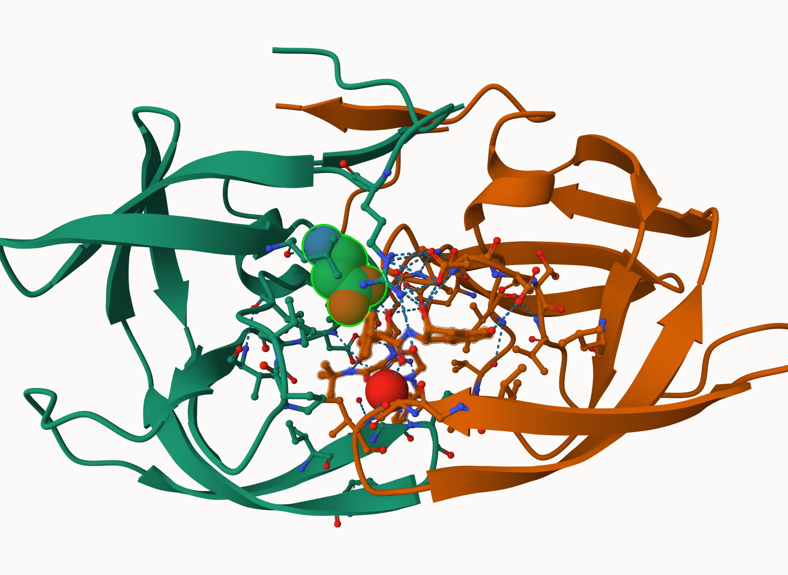

# Class 10
Aisha Mohamed (A16297530)

## Introduction to the RCSB Protein Data Bank (PDB).

First let’s see what’s in the database, the main repository of protein
structures.

Downloaded composition stats from: https://www.rcsb.orgs/stats/summary

For context: Release 2023_04 of 13-Sep-2023 of UnitProt/TrEMBL contains
251600,768 sequence entries. The PDB only contains 183,201.

``` r
stats <- read.csv("PDBstats.csv", row.names = 1)
stats
```

                              X.ray     EM    NMR Multiple.methods Neutron Other
    Protein (only)          158,844 11,759 12,296              197      73    32
    Protein/Oligosaccharide   9,260  2,054     34                8       1     0
    Protein/NA                8,307  3,667    284                7       0     0
    Nucleic acid (only)       2,730    113  1,467               13       3     1
    Other                       164      9     32                0       0     0
    Oligosaccharide (only)       11      0      6                1       0     4
                              Total
    Protein (only)          183,201
    Protein/Oligosaccharide  11,357
    Protein/NA               12,265
    Nucleic acid (only)       4,327
    Other                       205
    Oligosaccharide (only)       22

``` r
dim(stats)
```

    [1] 6 7

There is a problem here due to commas in the numbers. This causes them
to be treated as characters.

``` r
x <- stats$X.ray
x
```

    [1] "158,844" "9,260"   "8,307"   "2,730"   "164"     "11"     

``` r
as.numeric( gsub(",", "", x) )
```

    [1] 158844   9260   8307   2730    164     11

Making a function of how to do this.

``` r
rm.comma <- function(x) {
  as.numeric( gsub(",", "", x))
}
```

``` r
rm.comma(stats$EM)
```

    [1] 11759  2054  3667   113     9     0

I can use the `apply()` function to fix this whole table.

``` r
apply(stats, 2, rm.comma)
```

          X.ray    EM   NMR Multiple.methods Neutron Other  Total
    [1,] 158844 11759 12296              197      73    32 183201
    [2,]   9260  2054    34                8       1     0  11357
    [3,]   8307  3667   284                7       0     0  12265
    [4,]   2730   113  1467               13       3     1   4327
    [5,]    164     9    32                0       0     0    205
    [6,]     11     0     6                1       0     4     22

``` r
pdbstats <- apply(stats, 2, rm.comma)
rownames(pdbstats) <- rownames(stats)
head(pdbstats)
```

                             X.ray    EM   NMR Multiple.methods Neutron Other
    Protein (only)          158844 11759 12296              197      73    32
    Protein/Oligosaccharide   9260  2054    34                8       1     0
    Protein/NA                8307  3667   284                7       0     0
    Nucleic acid (only)       2730   113  1467               13       3     1
    Other                      164     9    32                0       0     0
    Oligosaccharide (only)      11     0     6                1       0     4
                             Total
    Protein (only)          183201
    Protein/Oligosaccharide  11357
    Protein/NA               12265
    Nucleic acid (only)       4327
    Other                      205
    Oligosaccharide (only)      22

``` r
totals <- apply(pdbstats, 2, sum)
totals
```

               X.ray               EM              NMR Multiple.methods 
              179316            17602            14119              226 
             Neutron            Other            Total 
                  77               37           211377 

> Q1: What percentage of structures in the PDB are solved by X-Ray and
> Electron Microscopy.

``` r
round(totals/totals["Total"] * 100, 2 )
```

               X.ray               EM              NMR Multiple.methods 
               84.83             8.33             6.68             0.11 
             Neutron            Other            Total 
                0.04             0.02           100.00 

> Q2: What proportion of structures in the PDB are protein?

``` r
pdbstats[1, "Total"]
```

    [1] 183201

``` r
pdbstats[1, "Total"] / sum(pdbstats[, "Total"] * 100, 2)
```

    [1] 0.008667025

``` r
round((pdbstats[1, "Total"] / 251600768) *100, 2) 
```

    [1] 0.07

> Q4: Water molecules normally have 3 atoms. Why do we see just oneatom
> per water molecule inthis structure?

This is a 2 Angstrom structure and hydrogen is not visible at this
resolution. 1 Angrstrom or better is needed.

> Q5: There is a critical “conserved” water molecule in the binding
> site. Can you identify this water molecule?

Water 308 is the conserved water molecule in the binding site.

> Q6: Generate and save a figure clearly showing the two distinct chains
> of HIV-protease along with the ligand. You might also consider showing
> the catalytic residues ASP 25 in each chain and the critical water (we
> recommend “Ball & Stick” for these side-chains). Add thisfigure to
> your Quarto document.

Here is a figure of HIP-Pr with the catalytic ASP residues, the MK1
compound and all the important water 308.



The bio3d package for structural bioinformatics.

``` r
library(bio3d)

pdb <- read.pdb("1hsg")
```

      Note: Accessing on-line PDB file

``` r
pdb
```


     Call:  read.pdb(file = "1hsg")

       Total Models#: 1
         Total Atoms#: 1686,  XYZs#: 5058  Chains#: 2  (values: A B)

         Protein Atoms#: 1514  (residues/Calpha atoms#: 198)
         Nucleic acid Atoms#: 0  (residues/phosphate atoms#: 0)

         Non-protein/nucleic Atoms#: 172  (residues: 128)
         Non-protein/nucleic resid values: [ HOH (127), MK1 (1) ]

       Protein sequence:
          PQITLWQRPLVTIKIGGQLKEALLDTGADDTVLEEMSLPGRWKPKMIGGIGGFIKVRQYD
          QILIEICGHKAIGTVLVGPTPVNIIGRNLLTQIGCTLNFPQITLWQRPLVTIKIGGQLKE
          ALLDTGADDTVLEEMSLPGRWKPKMIGGIGGFIKVRQYDQILIEICGHKAIGTVLVGPTP
          VNIIGRNLLTQIGCTLNF

    + attr: atom, xyz, seqres, helix, sheet,
            calpha, remark, call

``` r
head(pdb$atom)
```

      type eleno elety  alt resid chain resno insert      x      y     z o     b
    1 ATOM     1     N <NA>   PRO     A     1   <NA> 29.361 39.686 5.862 1 38.10
    2 ATOM     2    CA <NA>   PRO     A     1   <NA> 30.307 38.663 5.319 1 40.62
    3 ATOM     3     C <NA>   PRO     A     1   <NA> 29.760 38.071 4.022 1 42.64
    4 ATOM     4     O <NA>   PRO     A     1   <NA> 28.600 38.302 3.676 1 43.40
    5 ATOM     5    CB <NA>   PRO     A     1   <NA> 30.508 37.541 6.342 1 37.87
    6 ATOM     6    CG <NA>   PRO     A     1   <NA> 29.296 37.591 7.162 1 38.40
      segid elesy charge
    1  <NA>     N   <NA>
    2  <NA>     C   <NA>
    3  <NA>     C   <NA>
    4  <NA>     O   <NA>
    5  <NA>     C   <NA>
    6  <NA>     C   <NA>

# Predicting functional motions of a single structure

Let’s finish today with a bioinformatics calculation to predict the
functional motions of a PDB structure.

``` r
adk <- read.pdb("6s36")
```

      Note: Accessing on-line PDB file
       PDB has ALT records, taking A only, rm.alt=TRUE

``` r
m <- nma(adk)
```

     Building Hessian...        Done in 0.106 seconds.
     Diagonalizing Hessian...   Done in 1.237 seconds.

``` r
plot(m)
```


``` r
mktrj(m, file="adk_m7.pdb")
```
