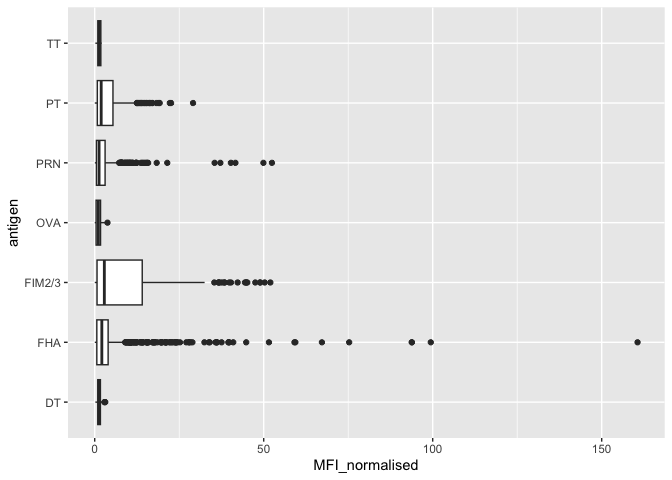
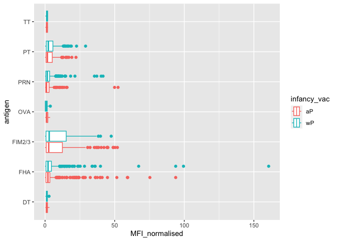

# Class19: Pertussis and the CMI-PB project
Aisha

Pertussis is a severe lung disease that is also known as whopping cough.

We will begin by investigating the number of Pertussis cases per year in
the US.

The data is linked here:
(https://www.cdc.gov/pertussis/surv-reporting/cases-by-year.html)

``` r
echo = FALSE

cdc <- data.frame(
                                                                                                                                                                                                            Year = c(1922L,1923L,1924L,
                                                                                                                                                                                                                     1925L,1926L,1927L,
                                                                                                                                                                                                                     1928L,1929L,1930L,
                                                                                                                                                                                                                     1931L,1932L,1933L,
                                                                                                                                                                                                                     1934L,1935L,1936L,
                                                                                                                                                                                                                     1937L,1938L,1939L,
                                                                                                                                                                                                                     1940L,1941L,
                                                                                                                                                                                                                     1942L,1943L,1944L,
                                                                                                                                                                                                                     1945L,1946L,1947L,
                                                                                                                                                                                                                     1948L,1949L,1950L,
                                                                                                                                                                                                                     1951L,1952L,1953L,
                                                                                                                                                                                                                     1954L,1955L,1956L,
                                                                                                                                                                                                                     1957L,1958L,1959L,
                                                                                                                                                                                                                     1960L,1961L,
                                                                                                                                                                                                                     1962L,1963L,1964L,
                                                                                                                                                                                                                     1965L,1966L,1967L,
                                                                                                                                                                                                                     1968L,1969L,1970L,
                                                                                                                                                                                                                     1971L,1972L,1973L,
                                                                                                                                                                                                                     1974L,1975L,1976L,
                                                                                                                                                                                                                     1977L,1978L,1979L,
                                                                                                                                                                                                                     1980L,1981L,
                                                                                                                                                                                                                     1982L,1983L,1984L,
                                                                                                                                                                                                                     1985L,1986L,1987L,
                                                                                                                                                                                                                     1988L,1989L,1990L,
                                                                                                                                                                                                                     1991L,1992L,1993L,
                                                                                                                                                                                                                     1994L,1995L,1996L,
                                                                                                                                                                                                                     1997L,1998L,1999L,
                                                                                                                                                                                                                     2000L,2001L,
                                                                                                                                                                                                                     2002L,2003L,2004L,
                                                                                                                                                                                                                     2005L,2006L,2007L,
                                                                                                                                                                                                                     2008L,2009L,2010L,
                                                                                                                                                                                                                     2011L,2012L,2013L,
                                                                                                                                                                                                                     2014L,2015L,2016L,
                                                                                                                                                                                                                     2017L,2018L,2019L,
                                                                                                                                                                                                                     2020L,2021L),
                                                                                                                                                                                    Cases = c(107473,164191,165418,
                                                                                                                                                                                                                     152003,202210,
                                                                                                                                                                                                                     181411,161799,197371,
                                                                                                                                                                                                                     166914,172559,
                                                                                                                                                                                                                     215343,179135,265269,
                                                                                                                                                                                                                     180518,147237,
                                                                                                                                                                                                                     214652,227319,103188,
                                                                                                                                                                                                                     183866,222202,
                                                                                                                                                                                                                     191383,191890,109873,
                                                                                                                                                                                                                     133792,109860,
                                                                                                                                                                                                                     156517,74715,69479,
                                                                                                                                                                                                                     120718,68687,45030,
                                                                                                                                                                                                                     37129,60886,62786,
                                                                                                                                                                                                                     31732,28295,32148,
                                                                                                                                                                                                                     40005,14809,
                                                                                                                                                                                                                     11468,17749,17135,
                                                                                                                                                                                                                     13005,6799,7717,9718,
                                                                                                                                                                                                                     4810,3285,4249,
                                                                                                                                                                                                                     3036,3287,1759,
                                                                                                                                                                                                                     2402,1738,1010,2177,
                                                                                                                                                                                                                     2063,1623,1730,
                                                                                                                                                                                                                     1248,1895,2463,
                                                                                                                                                                                                                     2276,3589,4195,2823,
                                                                                                                                                                                                                     3450,4157,4570,
                                                                                                                                                                                                                     2719,4083,6586,
                                                                                                                                                                                                                     4617,5137,7796,6564,
                                                                                                                                                                                                                     7405,7298,7867,
                                                                                                                                                                                                                     7580,9771,11647,
                                                                                                                                                                                                                     25827,25616,15632,
                                                                                                                                                                                                                     10454,13278,16858,
                                                                                                                                                                                                                     27550,18719,48277,
                                                                                                                                                                                                                     28639,32971,
                                                                                                                                                                                                                     20762,17972,18975,
                                                                                                                                                                                                                     15609,18617,6124,
                                                                                                                                                                                                                     2116)
                                                                                                                                                                                  )
```

``` r
head(cdc)
```

      Year  Cases
    1 1922 107473
    2 1923 164191
    3 1924 165418
    4 1925 152003
    5 1926 202210
    6 1927 181411

> Q1. With the help of the R “addin” package datapasta assign the CDC
> pertussis case number data to a data frame called cdc and use ggplot
> to make a plot of cases numbers over time.

``` r
library(ggplot2)

ggplot(cdc) + aes(Year, Cases) + geom_point() + geom_line() + labs(title = "Pertussis Cases by Year (1992-2019)")
```


> Q2. Using the ggplot geom_vline() function add lines to your previous
> plot for the 1946 introduction of the wP vaccine and the 1996 switch
> to aP vaccine (see example in the hint below). What do you notice?

``` r
ggplot(cdc) + aes(Year, Cases) + geom_point() + geom_line() + 
  labs(title = "Pertussis Cases by Year (1992-2019)") + 
  geom_vline(xintercept = 1946, linetype = "dashed", col = "blue") + 
  geom_vline(xintercept = 1996, linetype = "dashed", col = "red") + 
  geom_vline(xintercept = 2019, linetype = "dashed", col = "green") 
```


We can see a drop of cases after the introduction of the 46’ vaccine and
a small increase with the 96’ vaccine.

> Q3. Describe what happened after the introduction of the aP vaccine?
> Do you have a possible explanation for the observed trend?

After the introduction of the aP vaccine, there is a small lag and then
we can see how the Pertussis cases have increasingly rose afterwards.
The aP vaccine doesn’t seem to be as effective/long-term such as the wP
vaccine.

# Exploring CMI-PB data

Why is this vaccine-preventable disease on the upswing? To answer this
question we need to investigate the mechanisms underlying waning
protection against pertussis. This requires evaluation of
pertussis-specific immune responses over time in wP and aP vaccinated
individuals.

This is the goals of the CMI-PB project: https://www.cmi-pb.org/

The CMI-PB project makes its data available via “API-endpoint” that
return the JSON format.

We will use the **jsonlite** package to access this data. The main
funciton in this package is called `read_json()`.

``` r
library(jsonlite)

# Subject table

subject <- read_json("http://cmi-pb.org/api/subject", simplifyVector = TRUE)
specimen <- read_json("http://cmi-pb.org/api/specimen", simplifyVector = TRUE)

titer <- read_json("http://cmi-pb.org/api/v4/plasma_ab_titer", simplifyVector = TRUE)
```

Lets have a look at these new objects:

``` r
head(subject)
```

      subject_id infancy_vac biological_sex              ethnicity  race
    1          1          wP         Female Not Hispanic or Latino White
    2          2          wP         Female Not Hispanic or Latino White
    3          3          wP         Female                Unknown White
    4          4          wP           Male Not Hispanic or Latino Asian
    5          5          wP           Male Not Hispanic or Latino Asian
    6          6          wP         Female Not Hispanic or Latino White
      year_of_birth date_of_boost      dataset
    1    1986-01-01    2016-09-12 2020_dataset
    2    1968-01-01    2019-01-28 2020_dataset
    3    1983-01-01    2016-10-10 2020_dataset
    4    1988-01-01    2016-08-29 2020_dataset
    5    1991-01-01    2016-08-29 2020_dataset
    6    1988-01-01    2016-10-10 2020_dataset

``` r
head(titer)
```

      specimen_id isotype is_antigen_specific antigen        MFI MFI_normalised
    1           1     IgE               FALSE   Total 1110.21154       2.493425
    2           1     IgE               FALSE   Total 2708.91616       2.493425
    3           1     IgG                TRUE      PT   68.56614       3.736992
    4           1     IgG                TRUE     PRN  332.12718       2.602350
    5           1     IgG                TRUE     FHA 1887.12263      34.050956
    6           1     IgE                TRUE     ACT    0.10000       1.000000
       unit lower_limit_of_detection
    1 UG/ML                 2.096133
    2 IU/ML                29.170000
    3 IU/ML                 0.530000
    4 IU/ML                 6.205949
    5 IU/ML                 4.679535
    6 IU/ML                 2.816431

> Q4. How many aP and wP infancy vaccinated subjects are in the dataset?

``` r
table(subject$infancy_vac)
```


    aP wP 
    60 58 

> Q5. How many Male and Female subjects/patients are in the dataset?

``` r
table(subject$biological_sex)
```


    Female   Male 
        79     39 

> Q6. What is the breakdown of race and biological sex (e.g. number of
> Asian females, White males etc…)?

``` r
table(subject$race, subject$biological_sex)
```

                                               
                                                Female Male
      American Indian/Alaska Native                  0    1
      Asian                                         21   11
      Black or African American                      2    0
      More Than One Race                             9    2
      Native Hawaiian or Other Pacific Islander      1    1
      Unknown or Not Reported                       11    4
      White                                         35   20

``` r
library(tidyverse)
```

    ── Attaching core tidyverse packages ──────────────────────── tidyverse 2.0.0 ──
    ✔ dplyr     1.1.3     ✔ readr     2.1.4
    ✔ forcats   1.0.0     ✔ stringr   1.5.0
    ✔ lubridate 1.9.3     ✔ tibble    3.2.1
    ✔ purrr     1.0.2     ✔ tidyr     1.3.0
    ── Conflicts ────────────────────────────────────────── tidyverse_conflicts() ──
    ✖ dplyr::filter()  masks stats::filter()
    ✖ purrr::flatten() masks jsonlite::flatten()
    ✖ dplyr::lag()     masks stats::lag()
    ℹ Use the conflicted package (<http://conflicted.r-lib.org/>) to force all conflicts to become errors

``` r
today()
```

    [1] "2023-12-10"

``` r
today() - mdy("11-28-2001")
```

    Time difference of 8047 days

``` r
time_length( today() - ymd("2002-08-18"), "years")
```

    [1] 21.31143

> Q7. Using this approach determine (i) the average age of wP
> individuals, (ii) the average age of aP individuals; and (iii) are
> they significantly different?

``` r
subject$age <- today() - ymd(subject$year_of_birth)
```

``` r
library(dplyr)

 ap <- subject %>% filter(infancy_vac == "aP")

round( summary( time_length( ap$age, "years" ) ) )
```

       Min. 1st Qu.  Median    Mean 3rd Qu.    Max. 
         21      26      26      26      27      30 

``` r
# wP

wp <- subject %>% filter(infancy_vac == "wP") 
round( summary( time_length( wp$age, "years" ) ) )
```

       Min. 1st Qu.  Median    Mean 3rd Qu.    Max. 
         28      31      35      36      39      56 

The difference between both of their average ages is about 10 years.

> Q8. Determine the age of all individuals at time of boost?

``` r
subject$age <- ymd(subject$date_of_boost) - ymd(subject$year_of_birth)

subject$age_year <- time_length(subject$age, "year")

head(subject)
```

      subject_id infancy_vac biological_sex              ethnicity  race
    1          1          wP         Female Not Hispanic or Latino White
    2          2          wP         Female Not Hispanic or Latino White
    3          3          wP         Female                Unknown White
    4          4          wP           Male Not Hispanic or Latino Asian
    5          5          wP           Male Not Hispanic or Latino Asian
    6          6          wP         Female Not Hispanic or Latino White
      year_of_birth date_of_boost      dataset        age age_year
    1    1986-01-01    2016-09-12 2020_dataset 11212 days 30.69678
    2    1968-01-01    2019-01-28 2020_dataset 18655 days 51.07461
    3    1983-01-01    2016-10-10 2020_dataset 12336 days 33.77413
    4    1988-01-01    2016-08-29 2020_dataset 10468 days 28.65982
    5    1991-01-01    2016-08-29 2020_dataset  9372 days 25.65914
    6    1988-01-01    2016-10-10 2020_dataset 10510 days 28.77481

> Q9. With the help of a faceted boxplot or histogram (see below), do
> you think these two groups are significantly different?

``` r
ggplot(subject) +
  aes(time_length(age, "year"),
      fill=as.factor(infancy_vac)) +
  geom_histogram(show.legend=FALSE) +
  facet_wrap(vars(infancy_vac), nrow=2) +
  xlab("Age in years")
```

    `stat_bin()` using `bins = 30`. Pick better value with `binwidth`.


These two groups are very significantly differently.

# Merge or join tables

> Q9. Complete the code to join specimen and subject tables to make a
> new merged data frame containing all specimen records along with their
> associated subject details:

``` r
meta <- inner_join(specimen, subject)
```

    Joining with `by = join_by(subject_id)`

``` r
dim(meta)
```

    [1] 939  15

``` r
head(meta)
```

      specimen_id subject_id actual_day_relative_to_boost
    1           1          1                           -3
    2           2          1                            1
    3           3          1                            3
    4           4          1                            7
    5           5          1                           11
    6           6          1                           32
      planned_day_relative_to_boost specimen_type visit infancy_vac biological_sex
    1                             0         Blood     1          wP         Female
    2                             1         Blood     2          wP         Female
    3                             3         Blood     3          wP         Female
    4                             7         Blood     4          wP         Female
    5                            14         Blood     5          wP         Female
    6                            30         Blood     6          wP         Female
                   ethnicity  race year_of_birth date_of_boost      dataset
    1 Not Hispanic or Latino White    1986-01-01    2016-09-12 2020_dataset
    2 Not Hispanic or Latino White    1986-01-01    2016-09-12 2020_dataset
    3 Not Hispanic or Latino White    1986-01-01    2016-09-12 2020_dataset
    4 Not Hispanic or Latino White    1986-01-01    2016-09-12 2020_dataset
    5 Not Hispanic or Latino White    1986-01-01    2016-09-12 2020_dataset
    6 Not Hispanic or Latino White    1986-01-01    2016-09-12 2020_dataset
             age age_year
    1 11212 days 30.69678
    2 11212 days 30.69678
    3 11212 days 30.69678
    4 11212 days 30.69678
    5 11212 days 30.69678
    6 11212 days 30.69678

Antibody measurements in the blood.

``` r
head(titer)
```

      specimen_id isotype is_antigen_specific antigen        MFI MFI_normalised
    1           1     IgE               FALSE   Total 1110.21154       2.493425
    2           1     IgE               FALSE   Total 2708.91616       2.493425
    3           1     IgG                TRUE      PT   68.56614       3.736992
    4           1     IgG                TRUE     PRN  332.12718       2.602350
    5           1     IgG                TRUE     FHA 1887.12263      34.050956
    6           1     IgE                TRUE     ACT    0.10000       1.000000
       unit lower_limit_of_detection
    1 UG/ML                 2.096133
    2 IU/ML                29.170000
    3 IU/ML                 0.530000
    4 IU/ML                 6.205949
    5 IU/ML                 4.679535
    6 IU/ML                 2.816431

> Q10. Now using the same procedure join meta with titer data so we can
> further analyze this data in terms of time of visit aP/wP, male/female
> etc.

``` r
abdata <- inner_join(titer, meta)
```

    Joining with `by = join_by(specimen_id)`

``` r
dim(abdata)
```

    [1] 41810    22

``` r
head(abdata)
```

      specimen_id isotype is_antigen_specific antigen        MFI MFI_normalised
    1           1     IgE               FALSE   Total 1110.21154       2.493425
    2           1     IgE               FALSE   Total 2708.91616       2.493425
    3           1     IgG                TRUE      PT   68.56614       3.736992
    4           1     IgG                TRUE     PRN  332.12718       2.602350
    5           1     IgG                TRUE     FHA 1887.12263      34.050956
    6           1     IgE                TRUE     ACT    0.10000       1.000000
       unit lower_limit_of_detection subject_id actual_day_relative_to_boost
    1 UG/ML                 2.096133          1                           -3
    2 IU/ML                29.170000          1                           -3
    3 IU/ML                 0.530000          1                           -3
    4 IU/ML                 6.205949          1                           -3
    5 IU/ML                 4.679535          1                           -3
    6 IU/ML                 2.816431          1                           -3
      planned_day_relative_to_boost specimen_type visit infancy_vac biological_sex
    1                             0         Blood     1          wP         Female
    2                             0         Blood     1          wP         Female
    3                             0         Blood     1          wP         Female
    4                             0         Blood     1          wP         Female
    5                             0         Blood     1          wP         Female
    6                             0         Blood     1          wP         Female
                   ethnicity  race year_of_birth date_of_boost      dataset
    1 Not Hispanic or Latino White    1986-01-01    2016-09-12 2020_dataset
    2 Not Hispanic or Latino White    1986-01-01    2016-09-12 2020_dataset
    3 Not Hispanic or Latino White    1986-01-01    2016-09-12 2020_dataset
    4 Not Hispanic or Latino White    1986-01-01    2016-09-12 2020_dataset
    5 Not Hispanic or Latino White    1986-01-01    2016-09-12 2020_dataset
    6 Not Hispanic or Latino White    1986-01-01    2016-09-12 2020_dataset
             age age_year
    1 11212 days 30.69678
    2 11212 days 30.69678
    3 11212 days 30.69678
    4 11212 days 30.69678
    5 11212 days 30.69678
    6 11212 days 30.69678

> Q11. How many specimens (i.e. entries in abdata) do we have for each
> isotype?

``` r
table(abdata$isotype)
```


     IgE  IgG IgG1 IgG2 IgG3 IgG4 
    6698 3240 7968 7968 7968 7968 

> Q12. What are the different \$dataset values in abdata and what do you
> notice about the number of rows for the most “recent” dataset?

``` r
table(abdata$dataset)
```


    2020_dataset 2021_dataset 2022_dataset 
           31520         8085         2205 

The number of rows for the 2022_data is far less than the other
datasets. The number of rows seems to decrease as the years go by.

# Examine IgG Ab titer levels

Let’s focus on one of these IgG.

``` r
igg <- abdata %>% filter(isotype == "IgG")

head(igg)
```

      specimen_id isotype is_antigen_specific antigen        MFI MFI_normalised
    1           1     IgG                TRUE      PT   68.56614       3.736992
    2           1     IgG                TRUE     PRN  332.12718       2.602350
    3           1     IgG                TRUE     FHA 1887.12263      34.050956
    4          19     IgG                TRUE      PT   20.11607       1.096366
    5          19     IgG                TRUE     PRN  976.67419       7.652635
    6          19     IgG                TRUE     FHA   60.76626       1.096457
       unit lower_limit_of_detection subject_id actual_day_relative_to_boost
    1 IU/ML                 0.530000          1                           -3
    2 IU/ML                 6.205949          1                           -3
    3 IU/ML                 4.679535          1                           -3
    4 IU/ML                 0.530000          3                           -3
    5 IU/ML                 6.205949          3                           -3
    6 IU/ML                 4.679535          3                           -3
      planned_day_relative_to_boost specimen_type visit infancy_vac biological_sex
    1                             0         Blood     1          wP         Female
    2                             0         Blood     1          wP         Female
    3                             0         Blood     1          wP         Female
    4                             0         Blood     1          wP         Female
    5                             0         Blood     1          wP         Female
    6                             0         Blood     1          wP         Female
                   ethnicity  race year_of_birth date_of_boost      dataset
    1 Not Hispanic or Latino White    1986-01-01    2016-09-12 2020_dataset
    2 Not Hispanic or Latino White    1986-01-01    2016-09-12 2020_dataset
    3 Not Hispanic or Latino White    1986-01-01    2016-09-12 2020_dataset
    4                Unknown White    1983-01-01    2016-10-10 2020_dataset
    5                Unknown White    1983-01-01    2016-10-10 2020_dataset
    6                Unknown White    1983-01-01    2016-10-10 2020_dataset
             age age_year
    1 11212 days 30.69678
    2 11212 days 30.69678
    3 11212 days 30.69678
    4 12336 days 33.77413
    5 12336 days 33.77413
    6 12336 days 33.77413

Boxplot of MFI_normalised vs antigen.

``` r
ggplot(igg) + aes(MFI_normalised, antigen) + geom_boxplot()
```



``` r
ggplot(igg) + 
  aes(MFI_normalised, antigen, col = infancy_vac) + 
  geom_boxplot()
```



> Q13. Complete the following code to make a summary boxplot of Ab titer
> levels (MFI) for all antigens:

``` r
ggplot(igg) + 
  aes(MFI_normalised, antigen) + 
  geom_boxplot() + xlim(0,75) + facet_wrap(vars(visit), nrow=2)
```

    Warning: Removed 5 rows containing non-finite values (`stat_boxplot()`).


``` r
head(igg)
```

      specimen_id isotype is_antigen_specific antigen        MFI MFI_normalised
    1           1     IgG                TRUE      PT   68.56614       3.736992
    2           1     IgG                TRUE     PRN  332.12718       2.602350
    3           1     IgG                TRUE     FHA 1887.12263      34.050956
    4          19     IgG                TRUE      PT   20.11607       1.096366
    5          19     IgG                TRUE     PRN  976.67419       7.652635
    6          19     IgG                TRUE     FHA   60.76626       1.096457
       unit lower_limit_of_detection subject_id actual_day_relative_to_boost
    1 IU/ML                 0.530000          1                           -3
    2 IU/ML                 6.205949          1                           -3
    3 IU/ML                 4.679535          1                           -3
    4 IU/ML                 0.530000          3                           -3
    5 IU/ML                 6.205949          3                           -3
    6 IU/ML                 4.679535          3                           -3
      planned_day_relative_to_boost specimen_type visit infancy_vac biological_sex
    1                             0         Blood     1          wP         Female
    2                             0         Blood     1          wP         Female
    3                             0         Blood     1          wP         Female
    4                             0         Blood     1          wP         Female
    5                             0         Blood     1          wP         Female
    6                             0         Blood     1          wP         Female
                   ethnicity  race year_of_birth date_of_boost      dataset
    1 Not Hispanic or Latino White    1986-01-01    2016-09-12 2020_dataset
    2 Not Hispanic or Latino White    1986-01-01    2016-09-12 2020_dataset
    3 Not Hispanic or Latino White    1986-01-01    2016-09-12 2020_dataset
    4                Unknown White    1983-01-01    2016-10-10 2020_dataset
    5                Unknown White    1983-01-01    2016-10-10 2020_dataset
    6                Unknown White    1983-01-01    2016-10-10 2020_dataset
             age age_year
    1 11212 days 30.69678
    2 11212 days 30.69678
    3 11212 days 30.69678
    4 12336 days 33.77413
    5 12336 days 33.77413
    6 12336 days 33.77413

Focus in on IgG to the Pertussis Toxin (PT) antigen.

``` r
igg.pt <- igg %>% filter(antigen == "PT", dataset == "2021_dataset")
```

``` r
ggplot(igg.pt) + 
  aes(planned_day_relative_to_boost, MFI_normalised, 
      col = infancy_vac, group = subject_id) + 
  geom_point() + geom_line() + geom_vline(xintercept = 0, linetype = "dashed", col = "black") + 
  geom_line() + geom_vline(xintercept = 14, linetype = "dashed", col = "black") 
```


# Obtaining CMI-PB RNASeq data

For RNA-Seq data the API query mechanism quickly hits the web browser
interface limit for file size. We will present alternative download
mechanisms for larger CMI-PB datasets in the next section. However, we
can still do “targeted” RNA-Seq querys via the web accessible API.

``` r
url <- "https://www.cmi-pb.org/api/v2/rnaseq?versioned_ensembl_gene_id=eq.ENSG00000211896.7"

rna <- read_json(url, simplifyVector = TRUE) 
```

To facilitate further analysis we need to “join” the rna expression data
with our metadata meta, which is itself a join of sample and specimen
data.

``` r
#meta <- inner_join(specimen, subject)
ssrna <- inner_join(rna, meta)
```

    Joining with `by = join_by(specimen_id)`

> Q19. Make a plot of the time course of gene expression for IGHG1 gene
> (i.e. a plot of visit vs. tpm).

``` r
ggplot(ssrna) +
  aes(x = visit, y = tpm, group=subject_id) +
  geom_point() +
  geom_line(alpha=0.2)
```


> Q20.: What do you notice about the expression of this gene (i.e. when
> is it at it’s maximum level)?

The expression of this gene when it is at its’ maximum level has a TPM
value of over 6000. But the maximum level doesn’t endure for long as it
drops down very drastically.
