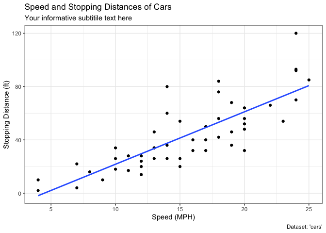
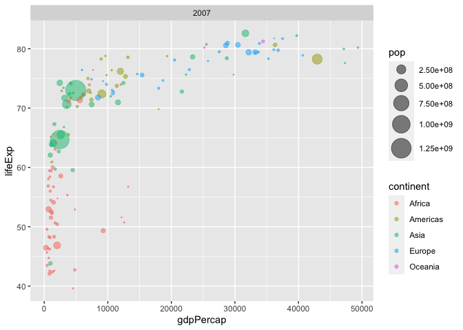
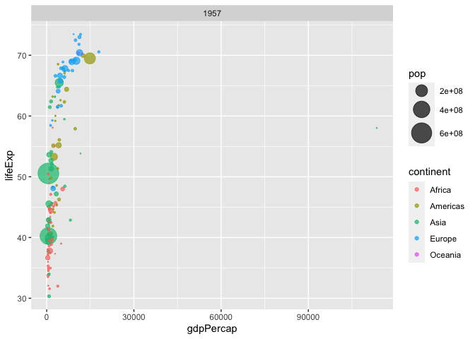

# Class5
A16297530

## Using ggplot2

The ggplot2 package needs to be installed as it does not come with R
‘out of the box’

We use the `install.packages()` function to do this.

``` r
head(cars)
```

      speed dist
    1     4    2
    2     4   10
    3     7    4
    4     7   22
    5     8   16
    6     9   10

To use ggplot I need to load it up before I can call any of the
functions in the package. I do this with the `library()` function.

``` r
library(ggplot2)
ggplot()
```


All ggplot figures have at least 3 things: - data (the stuff we want to
plot) - aesthetic mapping (aes values) - geoms

``` r
ggplot(cars) + aes(x=speed, y=dist) + geom_point() + labs(title = "Speed and Stopping Distances of Cars", x = "Speed (MPH)", y = "Stopping Distance (ft)", subtitle = "Your informative subtitile text here", caption = "Dataset: 'cars'") + geom_smooth(method= "lm", se = FALSE) + theme_bw()
```

    `geom_smooth()` using formula = 'y ~ x'



ggplot is not the only graphing system in R there are lots of others.
There is even “base R” graphics.

``` r
ggplot(cars)
```


``` r
url <- "https://bioboot.github.io/bimm143_S20/class-material/up_down_expression.txt"
genes <- read.delim(url)
head(genes)
```

            Gene Condition1 Condition2      State
    1      A4GNT -3.6808610 -3.4401355 unchanging
    2       AAAS  4.5479580  4.3864126 unchanging
    3      AASDH  3.7190695  3.4787276 unchanging
    4       AATF  5.0784720  5.0151916 unchanging
    5       AATK  0.4711421  0.5598642 unchanging
    6 AB015752.4 -3.6808610 -3.5921390 unchanging

``` r
p <- ggplot(genes) + aes(x = Condition1, y = Condition2, col = State) + geom_point() 

p 
```


``` r
p + scale_colour_manual(values = c("blue", "gray", "red")) + labs(title = "Gene Expression Changes Upon Drug Treatment", x = "Control (no drug)", y = "Drug Treatment")
```


``` r
url <- "https://raw.githubusercontent.com/jennybc/gapminder/master/inst/extdata/gapminder.tsv"

gapminder <- read.delim(url)
```

``` r
library(gapminder)
```


    Attaching package: 'gapminder'

    The following object is masked _by_ '.GlobalEnv':

        gapminder

``` r
library(dplyr)
```


    Attaching package: 'dplyr'

    The following objects are masked from 'package:stats':

        filter, lag

    The following objects are masked from 'package:base':

        intersect, setdiff, setequal, union

``` r
gapminder_2007 <- gapminder %>% filter(year==2007)

ggplot(gapminder_2007) + aes(x = gdpPercap, y = lifeExp, color = continent, size = pop) + geom_point(alpha = 0.5) +
  scale_size_area(max_size = 10) + facet_wrap(2007)
```



``` r
gapminder_1957 <- gapminder %>% filter(year == 1957)

ggplot(gapminder_1957) + aes(x = gdpPercap, y = lifeExp, color = continent, size = pop) + geom_point(alpha = 0.7) + scale_size_area(max_size = 10) + facet_wrap(1957)
```



``` r
library(gapminder)
library(dplyr)


gapminder_top5 <- gapminder %>% filter(year ==2007) %>% arrange(desc(pop)) %>% top_n(5, pop)

gapminder_top5
```

            country continent year lifeExp        pop gdpPercap
    1         China      Asia 2007  72.961 1318683096  4959.115
    2         India      Asia 2007  64.698 1110396331  2452.210
    3 United States  Americas 2007  78.242  301139947 42951.653
    4     Indonesia      Asia 2007  70.650  223547000  3540.652
    5        Brazil  Americas 2007  72.390  190010647  9065.801

``` r
ggplot(gapminder_top5) + geom_col(aes(x= country, y = pop))
```


``` r
ggplot(gapminder_top5) + aes(x = reorder(country, -pop), y = pop, fill = country) + geom_col(col = "gray30") + guides(fill = "none")
```


``` r
library(gapminder)
library(dplyr)


head(USArrests)
```

               Murder Assault UrbanPop Rape
    Alabama      13.2     236       58 21.2
    Alaska       10.0     263       48 44.5
    Arizona       8.1     294       80 31.0
    Arkansas      8.8     190       50 19.5
    California    9.0     276       91 40.6
    Colorado      7.9     204       78 38.7

``` r
USArrests$State <- rownames(USArrests)


ggplot(USArrests) + aes(x = reorder(State, Murder), y = Murder) + geom_point() + geom_segment(aes(x = State, xend = State, y = 0, yend = Murder), color = "blue") + coord_flip()
```


