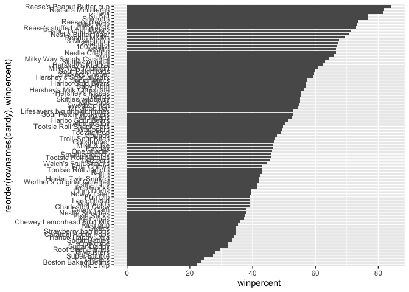
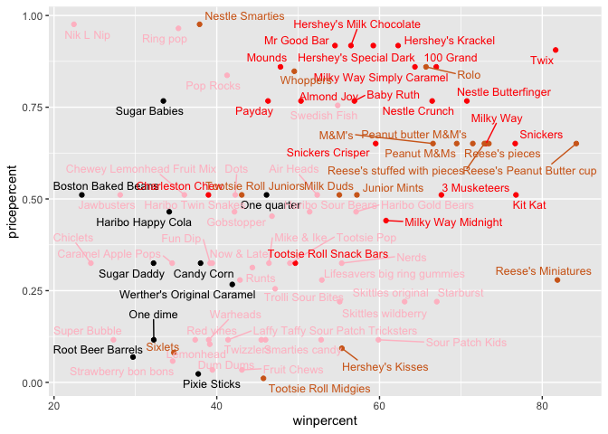
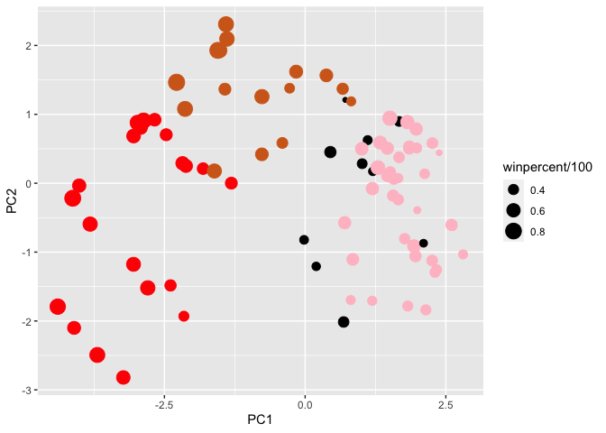

# Class 9
Aisha Mohamed (A16297530)

\#Importing candy data from the Halloween Project.

``` r
candy <- read.csv("candy-data.txt", row.names = 1)
```

> Q1. How many different candy types are in this dataset?

``` r
nrow(candy)
```

    [1] 85

> Q2. How many fruity candy types are in the dataset?

``` r
fruits_candy <- as.logical(candy$fruity)
sum(fruits_candy)
```

    [1] 38

Finding out which candies have the highest winpercent.

> Q3. What is your favorite candy in the dataset and what is it’s
> winpercent value?

``` r
candy["Reese's Peanut Butter cup", ]$winpercent
```

    [1] 84.18029

> Q4. What is the winpercent value for “Kit Kat”?

``` r
candy["Kit Kat", ]$winpercent
```

    [1] 76.7686

> Q5. What is the winpercent value for “Tootsie Roll Snack Bars”?

``` r
candy["Tootsie Roll Snack Bars", ]$winpercent
```

    [1] 49.6535

Using `skimr` package to give a quick overview.

``` r
library("skimr")
skim(candy)
```

|                                                  |       |
|:-------------------------------------------------|:------|
| Name                                             | candy |
| Number of rows                                   | 85    |
| Number of columns                                | 12    |
| \_\_\_\_\_\_\_\_\_\_\_\_\_\_\_\_\_\_\_\_\_\_\_   |       |
| Column type frequency:                           |       |
| numeric                                          | 12    |
| \_\_\_\_\_\_\_\_\_\_\_\_\_\_\_\_\_\_\_\_\_\_\_\_ |       |
| Group variables                                  | None  |

Data summary

**Variable type: numeric**

| skim_variable    | n_missing | complete_rate |  mean |    sd |    p0 |   p25 |   p50 |   p75 |  p100 | hist  |
|:-----------------|----------:|--------------:|------:|------:|------:|------:|------:|------:|------:|:------|
| chocolate        |         0 |             1 |  0.44 |  0.50 |  0.00 |  0.00 |  0.00 |  1.00 |  1.00 | ▇▁▁▁▆ |
| fruity           |         0 |             1 |  0.45 |  0.50 |  0.00 |  0.00 |  0.00 |  1.00 |  1.00 | ▇▁▁▁▆ |
| caramel          |         0 |             1 |  0.16 |  0.37 |  0.00 |  0.00 |  0.00 |  0.00 |  1.00 | ▇▁▁▁▂ |
| peanutyalmondy   |         0 |             1 |  0.16 |  0.37 |  0.00 |  0.00 |  0.00 |  0.00 |  1.00 | ▇▁▁▁▂ |
| nougat           |         0 |             1 |  0.08 |  0.28 |  0.00 |  0.00 |  0.00 |  0.00 |  1.00 | ▇▁▁▁▁ |
| crispedricewafer |         0 |             1 |  0.08 |  0.28 |  0.00 |  0.00 |  0.00 |  0.00 |  1.00 | ▇▁▁▁▁ |
| hard             |         0 |             1 |  0.18 |  0.38 |  0.00 |  0.00 |  0.00 |  0.00 |  1.00 | ▇▁▁▁▂ |
| bar              |         0 |             1 |  0.25 |  0.43 |  0.00 |  0.00 |  0.00 |  0.00 |  1.00 | ▇▁▁▁▂ |
| pluribus         |         0 |             1 |  0.52 |  0.50 |  0.00 |  0.00 |  1.00 |  1.00 |  1.00 | ▇▁▁▁▇ |
| sugarpercent     |         0 |             1 |  0.48 |  0.28 |  0.01 |  0.22 |  0.47 |  0.73 |  0.99 | ▇▇▇▇▆ |
| pricepercent     |         0 |             1 |  0.47 |  0.29 |  0.01 |  0.26 |  0.47 |  0.65 |  0.98 | ▇▇▇▇▆ |
| winpercent       |         0 |             1 | 50.32 | 14.71 | 22.45 | 39.14 | 47.83 | 59.86 | 84.18 | ▃▇▆▅▂ |

> Q6. Is there any variable/column that looks to be on a different scale
> to the majority of the other columns in the dataset?

``` r
skim(candy$winpercent)
```

|                                                  |                   |
|:-------------------------------------------------|:------------------|
| Name                                             | candy\$winpercent |
| Number of rows                                   | 85                |
| Number of columns                                | 1                 |
| \_\_\_\_\_\_\_\_\_\_\_\_\_\_\_\_\_\_\_\_\_\_\_   |                   |
| Column type frequency:                           |                   |
| numeric                                          | 1                 |
| \_\_\_\_\_\_\_\_\_\_\_\_\_\_\_\_\_\_\_\_\_\_\_\_ |                   |
| Group variables                                  | None              |

Data summary

**Variable type: numeric**

| skim_variable | n_missing | complete_rate |  mean |    sd |    p0 |   p25 |   p50 |   p75 |  p100 | hist  |
|:--------------|----------:|--------------:|------:|------:|------:|------:|------:|------:|------:|:------|
| data          |         0 |             1 | 50.32 | 14.71 | 22.45 | 39.14 | 47.83 | 59.86 | 84.18 | ▃▇▆▅▂ |

> Q7. What do you think a zero and one represent for the
> candy\$chocolate column?

True/False.

Visually interpreting the candy dataset.  
\> Q8. Plot a histogram of winpercent values

``` r
library(ggplot2)

ggplot(candy) + aes(winpercent) + geom_histogram(binwidth = 10)
```


> Q9. Is the distribution of winpercent values symmetrical?

No the distribution of winpercent values is not symmetrical.

> Q10. Is the center of the distribution above or below 50%?

``` r
mean(candy$winpercent)
```

    [1] 50.31676

> Q11. On average is chocolate candy higher or lower ranked than fruit
> candy?

``` r
choc.inds <- as.logical(candy$chocolate)
choc.win <- candy[choc.inds, "winpercent"]
choc.win
```

     [1] 66.97173 67.60294 50.34755 56.91455 38.97504 55.37545 62.28448 56.49050
     [9] 59.23612 57.21925 76.76860 71.46505 66.57458 55.06407 73.09956 60.80070
    [17] 64.35334 47.82975 54.52645 70.73564 66.47068 69.48379 81.86626 84.18029
    [25] 73.43499 72.88790 65.71629 34.72200 37.88719 76.67378 59.52925 48.98265
    [33] 43.06890 45.73675 49.65350 81.64291 49.52411

``` r
fruit.inds <- as.logical(candy$fruity)
fruit.win <- candy[fruit.inds, "winpercent"]
fruit.win
```

     [1] 52.34146 34.51768 36.01763 24.52499 42.27208 39.46056 43.08892 39.18550
     [9] 46.78335 57.11974 51.41243 42.17877 28.12744 41.38956 39.14106 52.91139
    [17] 46.41172 55.35405 22.44534 39.44680 41.26551 37.34852 35.29076 42.84914
    [25] 63.08514 55.10370 45.99583 59.86400 52.82595 67.03763 34.57899 27.30386
    [33] 54.86111 48.98265 47.17323 45.46628 39.01190 44.37552

``` r
#Average of chocolate candy ranks
mean(choc.win)
```

    [1] 60.92153

``` r
#Average of fruity candy ranks 
mean(fruit.win)
```

    [1] 44.11974

> Q12. Is this difference statistically significant?

``` r
t.test(choc.win, fruit.win)
```


        Welch Two Sample t-test

    data:  choc.win and fruit.win
    t = 6.2582, df = 68.882, p-value = 2.871e-08
    alternative hypothesis: true difference in means is not equal to 0
    95 percent confidence interval:
     11.44563 22.15795
    sample estimates:
    mean of x mean of y 
     60.92153  44.11974 

\#Overall candy rankings.

> Q13. What are the five least liked candy types in this set?

``` r
library(dplyr)
```


    Attaching package: 'dplyr'

    The following objects are masked from 'package:stats':

        filter, lag

    The following objects are masked from 'package:base':

        intersect, setdiff, setequal, union

``` r
candy %>% 
  arrange(winpercent) %>% 
  head(5)
```

                       chocolate fruity caramel peanutyalmondy nougat
    Nik L Nip                  0      1       0              0      0
    Boston Baked Beans         0      0       0              1      0
    Chiclets                   0      1       0              0      0
    Super Bubble               0      1       0              0      0
    Jawbusters                 0      1       0              0      0
                       crispedricewafer hard bar pluribus sugarpercent pricepercent
    Nik L Nip                         0    0   0        1        0.197        0.976
    Boston Baked Beans                0    0   0        1        0.313        0.511
    Chiclets                          0    0   0        1        0.046        0.325
    Super Bubble                      0    0   0        0        0.162        0.116
    Jawbusters                        0    1   0        1        0.093        0.511
                       winpercent
    Nik L Nip            22.44534
    Boston Baked Beans   23.41782
    Chiclets             24.52499
    Super Bubble         27.30386
    Jawbusters           28.12744

> Q14. What are the top 5 all time favorite candy types out of this set?

``` r
candy %>% 
  arrange(desc(winpercent)) %>% 
  head(5)
```

                              chocolate fruity caramel peanutyalmondy nougat
    Reese's Peanut Butter cup         1      0       0              1      0
    Reese's Miniatures                1      0       0              1      0
    Twix                              1      0       1              0      0
    Kit Kat                           1      0       0              0      0
    Snickers                          1      0       1              1      1
                              crispedricewafer hard bar pluribus sugarpercent
    Reese's Peanut Butter cup                0    0   0        0        0.720
    Reese's Miniatures                       0    0   0        0        0.034
    Twix                                     1    0   1        0        0.546
    Kit Kat                                  1    0   1        0        0.313
    Snickers                                 0    0   1        0        0.546
                              pricepercent winpercent
    Reese's Peanut Butter cup        0.651   84.18029
    Reese's Miniatures               0.279   81.86626
    Twix                             0.906   81.64291
    Kit Kat                          0.511   76.76860
    Snickers                         0.651   76.67378

> Q15. Make a first barplot of candy ranking based on winpercent values.

``` r
ggplot(candy) + aes(winpercent, rownames(candy)) + geom_col()
```


> Q16. This is quite ugly, use the reorder() function to get the bars
> sorted by winpercent?

``` r
ggplot(candy) + aes(winpercent, reorder(rownames(candy), winpercent)) + geom_col()
```



\#Time to add some useful color.

``` r
my_cols = rep("black", nrow(candy))
my_cols[as.logical(candy$chocolate)] = "chocolate"
my_cols[as.logical(candy$bar)] = "red"
my_cols[as.logical(candy$fruity)] = "pink"
```

``` r
ggplot(candy) + aes(winpercent, reorder(rownames(candy), winpercent)) + 
                      geom_col(fill = my_cols)
```


> Q17. What is the worst ranked chocolate candy?

The worst ranked chocolate candy is sixlets.

> Q18. What is the best ranked fruity candy?

The best rank fruity candy is starburst.

``` r
library(ggrepel)

# How about a plot of price vs win
ggplot(candy) +
  aes(winpercent, pricepercent, label=rownames(candy)) +
  geom_point(col=my_cols) + 
  geom_text_repel(col=my_cols, size=3.3, max.overlaps = 15)
```

    Warning: ggrepel: 1 unlabeled data points (too many overlaps). Consider
    increasing max.overlaps



\#Taking a look at pricepercent.

> Q19. Which candy type is the highest ranked in terms of winpercent for
> the least money - i.e. offers the most bang for your buck?

``` r
ords <- order(candy$winpercent, decreasing = TRUE)
head( candy[ords,c(11,12)], n=5 )
```

                              pricepercent winpercent
    Reese's Peanut Butter cup        0.651   84.18029
    Reese's Miniatures               0.279   81.86626
    Twix                             0.906   81.64291
    Kit Kat                          0.511   76.76860
    Snickers                         0.651   76.67378

Reece’s miniatures is highest ranked in winpercent for the least amount
of money.

> Q20. What are the top 5 most expensive candy types in the dataset and
> of these which is the least popular?

``` r
ord <- order(candy$pricepercent, decreasing = TRUE)
head( candy[ord,c(11,12)], n=5 )
```

                             pricepercent winpercent
    Nik L Nip                       0.976   22.44534
    Nestle Smarties                 0.976   37.88719
    Ring pop                        0.965   35.29076
    Hershey's Krackel               0.918   62.28448
    Hershey's Milk Chocolate        0.918   56.49050

Nik L Nip is the the most expensive and least liked candy in the data.

\#Exploring Correlation Structure

``` r
library(corrplot)
```

    corrplot 0.92 loaded

``` r
cij <- cor(candy)
corrplot(cij)
```


> Q22. Examining this plot what two variables are anti-correlated
> (i.e. have minus values)?

The most anti-correlated two variables are ‘fruity’ and ‘chocolate’.

> Q23. Similarly, what two variables are most positively correlated?

The most positively correlated two variables are ‘chocolate’ and ‘bar’.

\#Principal Analysis Component

``` r
pca <- prcomp(candy, scale = TRUE)
summary(pca)
```

    Importance of components:
                              PC1    PC2    PC3     PC4    PC5     PC6     PC7
    Standard deviation     2.0788 1.1378 1.1092 1.07533 0.9518 0.81923 0.81530
    Proportion of Variance 0.3601 0.1079 0.1025 0.09636 0.0755 0.05593 0.05539
    Cumulative Proportion  0.3601 0.4680 0.5705 0.66688 0.7424 0.79830 0.85369
                               PC8     PC9    PC10    PC11    PC12
    Standard deviation     0.74530 0.67824 0.62349 0.43974 0.39760
    Proportion of Variance 0.04629 0.03833 0.03239 0.01611 0.01317
    Cumulative Proportion  0.89998 0.93832 0.97071 0.98683 1.00000

``` r
plot(pca$x[,1], pca$x[,2], xlab = "PC1", ylab = 
       "PC2")
```


Change plotting character and add color.

``` r
plot(pca$x[,1:2], col=my_cols, pch=16)
```


``` r
# Make a new data-frame with our PCA results and candy data
my_data <- cbind(candy, pca$x[,1:3])


p <- ggplot(my_data) + 
        aes(x=PC1, y=PC2, 
            size=winpercent/100,  
            text=rownames(my_data),
            label=rownames(my_data)) +
        geom_point(col=my_cols)

p
```



``` r
library(ggrepel)

p + geom_text_repel(size=3.3, col=my_cols, max.overlaps = 15)  + 
  theme(legend.position = "none") +
  labs(title="Halloween Candy PCA Space",
       subtitle="Colored by type: chocolate bar (dark brown), chocolate other 
       (light brown), fruity (red), other (black)",
       caption="Data from 538")
```

    Warning: ggrepel: 15 unlabeled data points (too many overlaps). Consider
    increasing max.overlaps


``` r
par(mar=c(8,4,2,2))
barplot(pca$rotation[,1], las=2, ylab="PC1 Contribution")
```


> Q24. What original variables are picked up strongly by PC1 in the
> positive direction? Do these make sense to you?

Fruity, hard, and pluribus are the variables that have the most positive
PC1 contribution. This does make sense as these variables all have high
correlation with each other.
